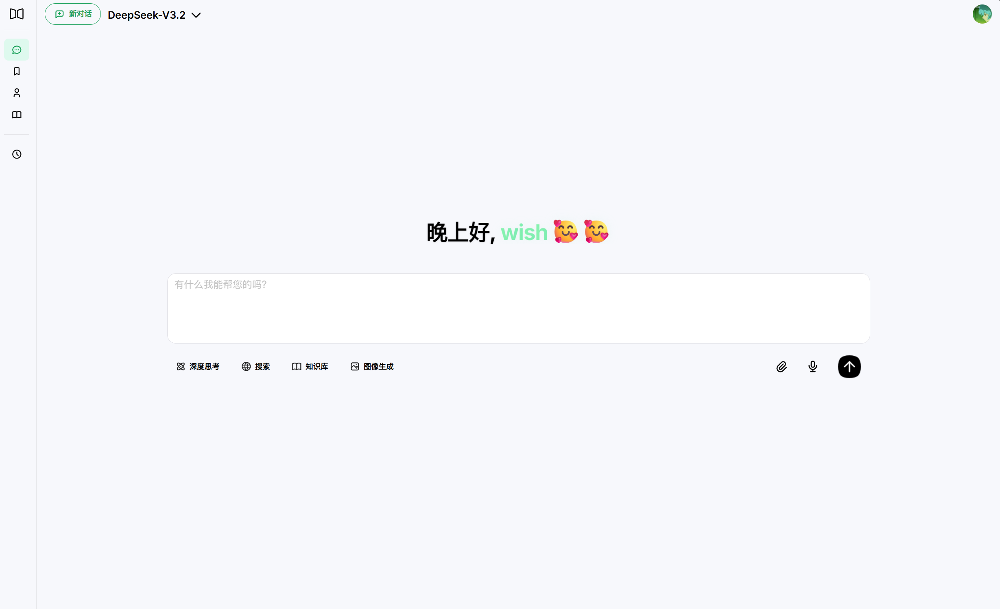

<div align="center">
  
  
  <h1 style="font-size: 2rem; font-weight: 700; margin-bottom: 0.5rem;">Mirror Chat</h1>
  
  <p><strong>🪞 镜像智能，对话无限</strong></p>
  
  <p>一款现代化的 AI 智能对话系统，支持多模型对话、RAG 文档问答、知识库管理等功能</p>
  
  <p>
    <a href="#-功能特性">功能特性</a> •
    <a href="#-在线演示">在线演示</a> •
    <a href="#-快速开始">快速开始</a> •
    <a href="#-技术栈">技术栈</a> •
    <a href="#-项目结构">项目结构</a>
  </p>
  
  <p>
    
    
    
    
  </p>
</div>

---

## 📸 项目截图

<div align="center">
  
</div>

## ✨ 功能特性

### 🤖 多模型支持

| 模型                 | 思考模式 | 联网搜索 | 描述                                                    |
| -------------------- | :------: | :------: | ------------------------------------------------------- |
| **Qwen3-Max**        |    ✅    |    ✅    | 通义千问 3 系列 Max 模型，智能体编程与工具调用领域 SOTA |
| **DeepSeek-V3.2**    |    ✅    |    ✅    | 稀疏注意力机制，思考融入工具调用                        |
| **GLM-4.7**          |    ✅    |    ❌    | 智谱旗舰模型，355B 参数，强编程与推理能力               |
| **Kimi-K2-Thinking** |    ✅    |    ❌    | 月之暗面思考模型，通用 Agentic 能力                     |
| **Qwen3-VL-Plus**    |    ✅    |    ❌    | 视觉理解模型，视觉智能体能力顶尖                        |
| **Qwen-Image-Max**   |    ❌    |    ❌    | 图像生成模型，真实质感与细腻纹理                        |

### 💬 智能对话

- **流式响应** - 实时显示 AI 回复，打字机效果呈现
- **思考模式** - 展示 AI 推理过程，透明化思考链路
- **联网搜索** - 部分模型支持实时网络信息检索
- **上下文管理** - 智能管理对话上下文，长对话不迷失

### 📚 知识库管理（RAG）

- 📄 **文档上传** - 支持 PDF、Word、Markdown 等多种格式
- 🔍 **向量化存储** - 智能文档分块与向量化
- 🎯 **智能问答** - 基于知识库的精准问答
- 📥 **文档管理** - 下载、删除、预览知识库文档

### 🎭 角色系统

- 🎨 **系统预设角色** - 内置多种专业角色模板
- ✏️ **自定义角色** - 创建专属 AI 助手人设
- 🔄 **动态切换** - 对话中灵活切换角色
- 💡 **System Prompt** - 角色影响对话风格与专业领域

### 🎙️ 语音交互

| 功能                 | 描述                          |
| -------------------- | ----------------------------- |
| **语音识别 (ASR)**   | 将语音实时转换为文字输入      |
| **文字转语音 (TTS)** | AI 回复语音朗读，多种音色可选 |
| **音频缓存**         | 智能缓存优化，减少重复请求    |

### 🔐 安全特性

- 🔑 **JWT + Refresh Token** - 双令牌认证机制
- 🔒 **RSA 加密** - 敏感数据加密传输
- 🛡️ **路由守卫** - 自动拦截未认证请求
- 🔄 **Token 自动刷新** - 支持并发请求队列

### 🎨 用户体验

- 🌓 **主题切换** - 明暗主题一键切换
- 📱 **响应式设计** - 完美适配桌面与移动端
- ⭐ **收藏功能** - 收藏重要对话内容
- 🗂️ **历史管理** - 完整的对话记录管理与搜索

---

## 🚀 快速开始

### 环境要求

- **Node.js** >= 16.0.0
- **npm** >= 8.0.0

### 安装

```bash
# 克隆项目
git clone https://github.com/Ny9u/mirror-chat.git

# 进入项目目录
cd mirror-chat

# 安装依赖
npm install
```

### 配置

在项目根目录创建 `.env` 文件：

```env
# 后端 API 地址
VITE_API_BASE_URL=http://127.0.0.1:3000
```

### 启动

```bash
# 启动开发服务器（默认端口 5174）
npm run dev
```

### 构建

```bash
# 构建生产版本
npm run build

# 预览构建结果
npm run preview
```

---

## 🛠️ 技术栈

<table>
  <tr>
    <th>类别</th>
    <th>技术</th>
  </tr>
  <tr>
    <td><strong>前端框架</strong></td>
    <td>
      
      
      
      
    </td>
  </tr>
  <tr>
    <td><strong>UI 组件</strong></td>
    <td>
      
      
    </td>
  </tr>
  <tr>
    <td><strong>核心库</strong></td>
    <td>
      OpenAI SDK • Axios • markdown-it • highlight.js • typed.js • JSEncrypt
    </td>
  </tr>
  <tr>
    <td><strong>样式</strong></td>
    <td>
      
    </td>
  </tr>
</table>

---

## 📁 项目结构

```
mirror-chat/
├── public/                 # 静态资源
├── src/
│   ├── assets/            # 图片、图标等资源
│   ├── components/        # 公共组件
│   │   └── WaveCanvas.vue # 音频波形组件
│   ├── config/            # 配置文件
│   │   ├── api.js         # API 端点配置
│   │   └── models.js      # AI 模型配置
│   ├── router/            # 路由配置
│   ├── services/          # 业务服务
│   │   ├── asrService.js  # 语音识别服务
│   │   ├── chat.js        # 对话服务
│   │   ├── ttsService.js  # 语音合成服务
│   │   └── user.js        # 用户服务
│   ├── stores/            # Pinia 状态管理
│   ├── styles/            # 全局样式
│   ├── utils/             # 工具函数
│   │   ├── encryption.js  # RSA 加密
│   │   ├── request.js     # HTTP 请求封装
│   │   └── ...
│   └── views/             # 页面组件
│       ├── auth/          # 认证页面
│       ├── chat/          # 对话页面
│       ├── collection/    # 收藏页面
│       ├── knowledge/     # 知识库页面
│       └── setting/       # 设置页面
├── index.html
├── package.json
└── vite.config.js
```

---

## 📝 开发指南

### 路径别名

- `@` 指向 `src` 目录

### 添加新的 API

1. 在 [`src/config/api.js`](src/config/api.js) 中定义 API 端点
2. 如需认证，添加到 `authRequiredApis` 数组
3. 使用 `Request()` 或 `FormDataRequest()` 发起请求

### 添加新的 AI 模型

在 [`src/config/models.js`](src/config/models.js) 中添加模型配置：

```javascript
{
  name: '模型名称',
  key: 'model-id',
  desc: '模型描述',
  thinkingMode: true,  // 是否支持思考模式
  netSearch: false,    // 是否支持联网搜索
  expiredTime: null    // 过期时间（可选）
}
```

### 代码规范

- 使用 Vue 3 Composition API
- 使用 `<script setup>` 语法
- 样式使用 Less 预处理器

---

## 🤝 贡献

欢迎提交 Issue 和 Pull Request！

1. Fork 本仓库
2. 创建特性分支 (`git checkout -b feature/AmazingFeature`)
3. 提交更改 (`git commit -m 'Add some AmazingFeature'`)
4. 推送到分支 (`git push origin feature/AmazingFeature`)
5. 提交 Pull Request

---

## 📄 许可证

本项目基于 [MIT License](LICENSE) 开源。

---

<div align="center">
  
  **Made with ❤️ by [Ny9u](https://github.com/Ny9u)**
  
  <p>
    如果这个项目对你有帮助，请给一个 ⭐️ Star 支持一下！
  </p>
  
</div>
